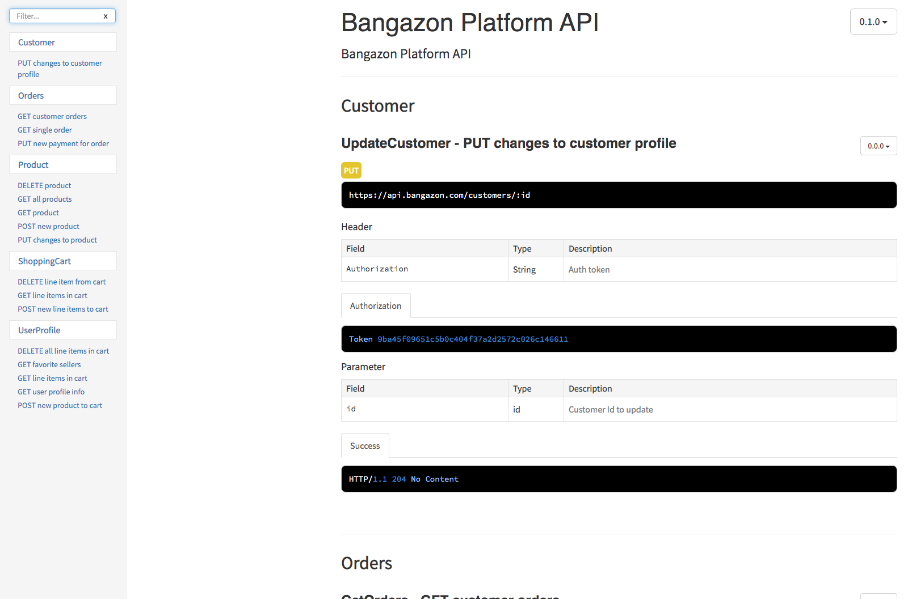

# Bangazon Platform API

## Prerequisites

### Mac OS

```sh
brew install libtiff libjpeg webp little-cms2
```

### Linux

```sh
sudo apt-get install libtiff5-dev libjpeg8-dev libopenjp2-7-dev zlib1g-dev \
    libfreetype6-dev liblcms2-dev libwebp-dev tcl8.6-dev tk8.6-dev python3-tk \
    libharfbuzz-dev libfribidi-dev libxcb1-dev
```

## Setup

1. Clone this repository and change to the directory in the terminal.
1. Run `pipenv shell`
1. Run `pipenv install`
1. Execute `./seed_data.sh`

Now that your database is set up all you have to do is run the command:

```sh
python manage.py runserver
```

## Postman Request Collection

1. Open Postman
1. Click Import from the navbar
1. Choose the Link option
1. Paste in this URL:
    `https://www.getpostman.com/collections/c29b98258d312bf240b7`
1. Your should be prompted to import **Bangazon Python API**.
1. Click the Import button to complete the process.

To test it out, expand the Profile sub-collection, double-click on Login and send the request. You should get a response back that looks like this.

```json
{
    "valid": true,
    "token": "9ba45f09651c5b0c404f37a2d2572c026c146690",
    "id": 5
}
```

## Documentation

To view browser-based documentation for the project, follow these steps.

1. Run `./renderdocs.sh`
1. `cd docs`
1. Then start a simple web server like `http-server` or `serve`.
1. In your web browser, go to the URL provided by your web server.

